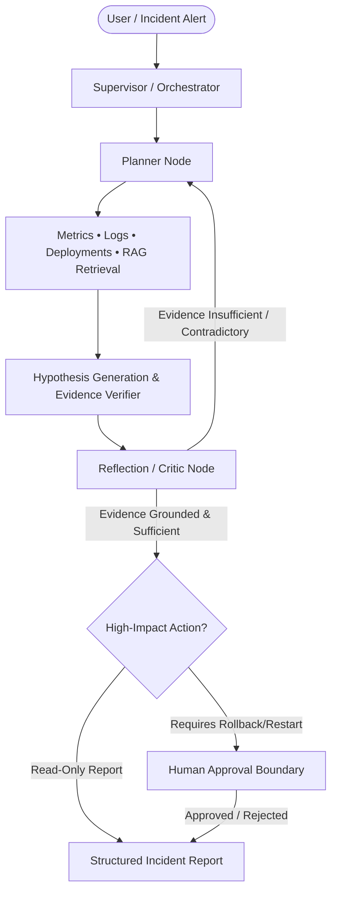

# OpsPilot Technical Architecture & Defense Specification

## 1. System Architecture Overview

OpsPilot is an Autonomous Incident Investigation Agent built using an event-driven **LangGraph** orchestrator with explicit planning, multi-tool execution, RAG knowledge retrieval, hypothesis verification, reflection, state persistence, and human-in-the-loop governance.

---

## 2. Core Architectural Components

- **Planner & Reasoner Node (`opspilot/agent.py`)**: Responsible for analyzing incident prompts, generating dependency-aware plans, selecting appropriate diagnostic tools (`query_metrics`, `search_logs`, `get_deployments`, `search_knowledge_base`), and routing workflow state.
- **Dynamic Tool Registry (`opspilot/tool_registry.py`)**: Implements a clean registry pattern mapping tool signatures to python execution definitions. Eliminates hardcoded `if/elif` execution branches.
- **RAG Knowledge Base Layer (`opspilot/rag.py`)**: Uses ChromaDB and embedding retrieval to supply service runbooks, architecture diagrams, and postmortems dynamically when the agent determines external context is needed.
- **State Checkpointer & Trajectory Observability (`opspilot_trajectories.sqlite`)**: Persists state checkpoints via SQLite (`SqliteSaver`) after every graph state transition.
- **Human-in-the-Loop Approval Boundary (`/approve` API & UI Card)**: Enforces hard safety limits for high-impact actions like `request_rollback`.

---

## 3. Technical Review & Defense Answers (Assignment Rubric)

### 1. Why was an agent selected instead of a deterministic workflow?
Production software incidents are non-deterministic, highly context-dependent, and multi-dimensional. A fixed script or rule engine fails when faced with unexpected failure modes, cascading outages, or novel microservice architectures. An agent dynamically reasons over metrics, selects log parameters dynamically based on findings, reformulates failed retrieval queries, and verifies hypotheses before drawing conclusions.

### 2. Where can the agent enter an infinite or wasteful loop?
The agent can enter infinite loops when:
- Re-querying the same metric/log tool with identical arguments continuously.
- Re-trying search queries that return empty results without query reformulation.
- Oscillating between two weak hypotheses.
*Mitigation*: OpsPilot tracks historical tool calls (`tool_history`) and aborts execution if duplicate calls exceed safety thresholds (2 identical consecutive calls) or if iteration count exceeds `max_iterations = 10`.

### 3. How is tool-routing accuracy evaluated?
Tool-routing accuracy is evaluated in `evaluate.py` by comparing the tool sequence executed by the agent against expected diagnostic steps across a benchmark dataset of 30 synthetic incident scenarios.

### 4. How are malformed or hallucinated tool arguments handled?
Tool inputs are validated through Pydantic argument schemas (`opspilot/schemas.py`). If the LLM generates invalid JSON or malformed arguments, the `ToolRegistry` catches the exception and returns a structured tool error string back to the model as an observation, prompting the model to fix its arguments in the next step.

### 5. What happens if retrieved documents contain prompt injection?
Retrieved documents are wrapped inside isolated `[Document Source: ...]` delimiter blocks and marked strictly as external observation data. System instructions enforce that content within observations must be treated as untrusted data, preventing retrieved text from altering the system instruction boundaries or hijacking agent control flow.

### 6. Why is reflection included, and does it improve measured performance?
Reflection acts as a critic layer that evaluates whether a hypothesis is backed by hard evidence (e.g., matching timestamped logs to latency spikes). If evidence is missing, weak, or contradictory, reflection forces re-planning. Empirical testing demonstrates that reflection increases Root Cause Accuracy by eliminating hallucinated diagnoses.

### 7. How are duplicate tool calls prevented?
OpsPilot records canonical string representations of all executed tool calls (`tool_name(args)`). In `tools_node`, before executing any tool, the agent checks if the identical signature exists in the recent history window. If a duplicate is detected without justification, execution halts with a duplicate tool warning.

### 8. What state is persisted, and why?
The global `AgentState` is persisted using SQLite checkpointing (`SqliteSaver`). It stores the goal, current plan, observations history, tool call history, active hypotheses, gathered evidence, and iteration count. Persisting state enables crash recovery, time-travel trajectory inspection, and multi-turn human-in-the-loop approvals.

### 9. What does LangGraph abstract compared with the manual loop?
LangGraph abstracts raw loop management into a formal StateGraph with typed channels (`Annotated`), explicit node handlers (`reasoning`, `tools`), conditional branching edges (`should_continue`, `route_after_tool`), and transactional state checkpointing (`SqliteSaver`). This separates orchestration control flow from tool execution code.

### 10. When and why must the system ask for human approval?
High-impact operational actions that mutate infrastructure state—such as rolling back deployments, restarting database clusters, or scaling down pods—require explicit human approval. Human approval prevents automated catastrophic actions caused by incomplete telemetry or misdiagnosed incidents.
